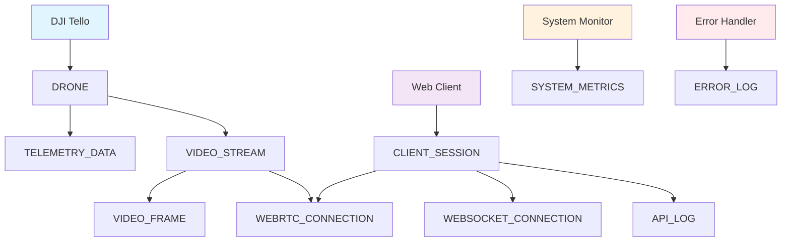

# 📊 Entity-Relationship Diagram (E-R図)

DJI Tello Multi-Drone Monitorのデータモデルとエンティティ関係を表すE-R図をMermaidで表現します。

```mermaid
erDiagram
    %% エンティティの定義
    
    DRONE_MANAGER {
        string manager_id PK "ドローンマネージャーID"
        datetime created_at "作成日時"
        string status "マネージャー状態"
        int max_connections "最大接続数"
    }
    
    DRONE {
        string drone_id PK "ドローンID"
        string ip_address "IPアドレス"
        string connection_status "接続状態"
        datetime connected_at "接続日時"
        datetime last_seen "最終通信日時"
        string manager_id FK "所属マネージャーID"
    }
    
    TELEMETRY_DATA {
        string telemetry_id PK "テレメトリID"
        string drone_id FK "ドローンID"
        int battery_level "バッテリー残量(%)"
        float temperature "温度(℃)"
        int height "高度(cm)"
        float speed_x "X軸速度(cm/s)"
        float speed_y "Y軸速度(cm/s)"
        float speed_z "Z軸速度(cm/s)"
        int flight_time "飛行時間(秒)"
        string wifi_signal "WiFi信号強度"
        datetime recorded_at "記録日時"
    }
    
    VIDEO_STREAM {
        string stream_id PK "ストリームID"
        string drone_id FK "ドローンID"
        string stream_status "ストリーム状態"
        int fps "フレームレート"
        int resolution_width "解像度幅"
        int resolution_height "解像度高"
        string codec "映像コーデック"
        datetime started_at "開始日時"
        datetime stopped_at "停止日時"
    }
    
    VIDEO_FRAME {
        string frame_id PK "フレームID"
        string stream_id FK "ストリームID"
        binary frame_data "フレームデータ"
        int frame_number "フレーム番号"
        datetime timestamp "タイムスタンプ"
        int latency_ms "レイテンシ(ms)"
    }
    
    WEBRTC_CONNECTION {
        string connection_id PK "WebRTC接続ID"
        string stream_id FK "ストリームID"
        string client_id "クライアントID"
        string connection_state "接続状態"
        string ice_state "ICE状態"
        datetime established_at "確立日時"
        datetime closed_at "切断日時"
    }
    
    CLIENT_SESSION {
        string session_id PK "セッションID"
        string client_ip "クライアントIP"
        string user_agent "ユーザーエージェント"
        datetime connected_at "接続日時"
        datetime last_activity "最終アクティビティ"
        string session_status "セッション状態"
    }
    
    WEBSOCKET_CONNECTION {
        string websocket_id PK "WebSocket接続ID"
        string session_id FK "セッションID"
        string connection_status "接続状態"
        datetime established_at "確立日時"
        datetime closed_at "切断日時"
        int messages_sent "送信メッセージ数"
        int messages_received "受信メッセージ数"
    }
    
    API_LOG {
        string log_id PK "ログID"
        string session_id FK "セッションID"
        string endpoint "APIエンドポイント"
        string method "HTTPメソッド"
        int status_code "ステータスコード"
        datetime requested_at "リクエスト日時"
        int response_time_ms "レスポンス時間(ms)"
        text request_body "リクエストボディ"
        text response_body "レスポンスボディ"
    }
    
    SYSTEM_METRICS {
        string metric_id PK "メトリクスID"
        float cpu_usage "CPU使用率(%)"
        float memory_usage "メモリ使用率(%)"
        float network_in "ネットワーク受信(MB/s)"
        float network_out "ネットワーク送信(MB/s)"
        int active_connections "アクティブ接続数"
        int active_streams "アクティブストリーム数"
        datetime recorded_at "記録日時"
    }
    
    ERROR_LOG {
        string error_id PK "エラーID"
        string drone_id FK "ドローンID"
        string error_type "エラータイプ"
        string error_code "エラーコード"
        text error_message "エラーメッセージ"
        text stack_trace "スタックトレース"
        datetime occurred_at "発生日時"
        string severity "重要度"
        boolean resolved "解決済み"
    }
    
    %% リレーションシップの定義
    
    DRONE_MANAGER ||--o{ DRONE : manages
    DRONE ||--o{ TELEMETRY_DATA : generates
    DRONE ||--o{ VIDEO_STREAM : produces
    DRONE ||--o{ ERROR_LOG : logs
    
    VIDEO_STREAM ||--o{ VIDEO_FRAME : contains
    VIDEO_STREAM ||--o{ WEBRTC_CONNECTION : establishes
    
    CLIENT_SESSION ||--o{ WEBSOCKET_CONNECTION : maintains
    CLIENT_SESSION ||--o{ API_LOG : generates
    CLIENT_SESSION ||--o{ WEBRTC_CONNECTION : owns
    
    %% カーディナリティと制約の説明
    %%
    %% DRONE_MANAGER : DRONE = 1 : N
    %% - 1つのドローンマネージャーは複数のドローンを管理
    %% 
    %% DRONE : TELEMETRY_DATA = 1 : N
    %% - 1つのドローンは複数のテレメトリデータを生成
    %%
    %% DRONE : VIDEO_STREAM = 1 : N
    %% - 1つのドローンは複数の映像ストリームを持つ（時系列）
    %%
    %% VIDEO_STREAM : VIDEO_FRAME = 1 : N
    %% - 1つのストリームは複数のフレームを含む
    %%
    %% VIDEO_STREAM : WEBRTC_CONNECTION = 1 : N
    %% - 1つのストリームは複数のWebRTC接続を持つ（複数クライアント）
    %%
    %% CLIENT_SESSION : WEBSOCKET_CONNECTION = 1 : 1
    %% - 1つのセッションは1つのWebSocket接続を持つ
    %%
    %% CLIENT_SESSION : API_LOG = 1 : N
    %% - 1つのセッションは複数のAPIログを生成
```

## エンティティ詳細説明

### 🎯 主要エンティティ

#### DRONE_MANAGER
- システム全体のドローン管理を行う中央制御エンティティ
- 複数ドローンの接続・切断・監視を統括
- 同時接続可能なドローン数の制限管理

#### DRONE
- 個別のDJI Telloドローンを表現
- 接続状態、IPアドレス、最終通信時刻を管理
- 1台のドローンマネージャーに所属

#### TELEMETRY_DATA
- ドローンから定期的に送信されるセンサーデータ
- バッテリー、温度、位置、速度情報を時系列で保存
- リアルタイム監視とログ分析に使用

#### VIDEO_STREAM
- ドローンからの映像ストリーミング情報
- ストリーム開始・停止、解像度、コーデック情報を管理
- WebRTC接続との紐付け

### 🔄 通信・接続エンティティ

#### WEBRTC_CONNECTION
- クライアントとの低レイテンシ映像配信接続
- P2P接続状態、ICE状態を追跡
- 複数クライアントの同時視聴対応

#### WEBSOCKET_CONNECTION
- リアルタイム双方向通信の管理
- コマンド送信・テレメトリ受信
- 接続品質・メッセージ統計の記録

#### CLIENT_SESSION
- Webブラウザクライアントのセッション管理
- ユーザー識別・アクセス制御
- 操作ログ・使用統計の基盤

### 📊 監視・ログエンティティ

#### SYSTEM_METRICS
- システム全体のパフォーマンス監視
- CPU、メモリ、ネットワーク使用量
- キャパシティプランニング・障害予兆検知

#### ERROR_LOG
- エラー・例外の詳細記録
- ドローン通信エラー、システム障害
- トラブルシューティング・品質改善

#### API_LOG
- REST APIアクセスの監査ログ
- セキュリティ監視・使用量分析
- パフォーマンス最適化の基礎データ

## データフロー概要



## 主要な制約・ルール

### 🔒 整合性制約

1. **ドローン接続制約**
   - 1つのドローンは同時に1つのマネージャーにのみ接続
   - IPアドレスの重複は許可されない

2. **ストリーミング制約**
   - 1つのドローンは同時に1つのアクティブストリームのみ
   - VIDEO_FRAMEは対応するVIDEO_STREAMが存在する場合のみ作成

3. **クライアント制約**
   - 1つのセッションは1つのWebSocket接続のみ
   - WebRTC接続はアクティブなVIDEO_STREAMが必要

### ⏱️ 時系列制約

1. **タイムスタンプの順序性**
   - TELEMETRY_DATA.recorded_at ≤ 現在時刻
   - VIDEO_STREAM.stopped_at ≥ started_at

2. **データ保持期間**
   - TELEMETRY_DATA: 30日間
   - VIDEO_FRAME: リアルタイムのみ（永続化なし）
   - API_LOG: 90日間

この E-R図は、システムの主要なデータ構造と関係性を表現し、開発・運用・保守の指針として活用されます。