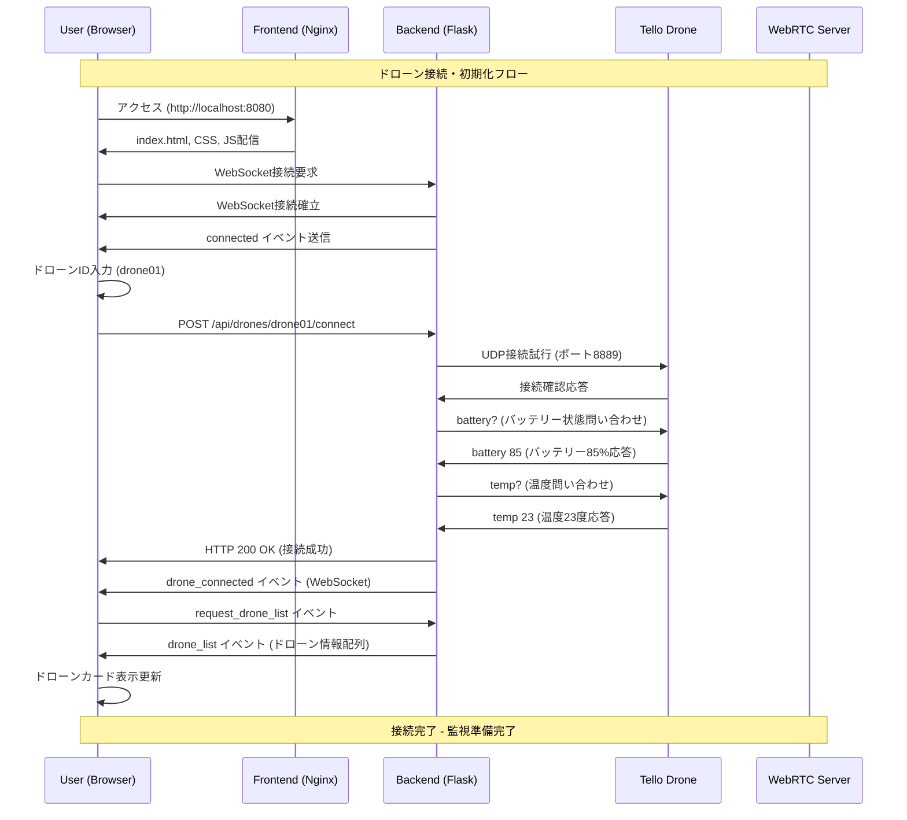
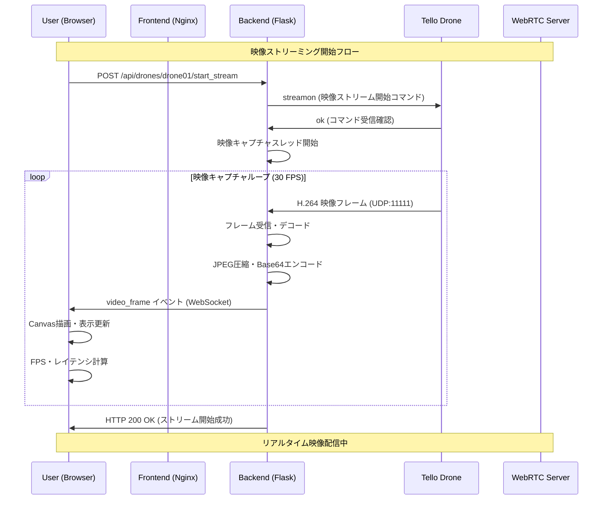
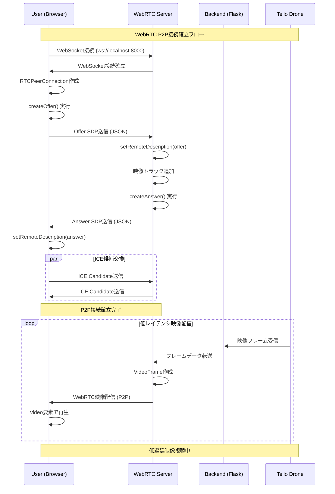
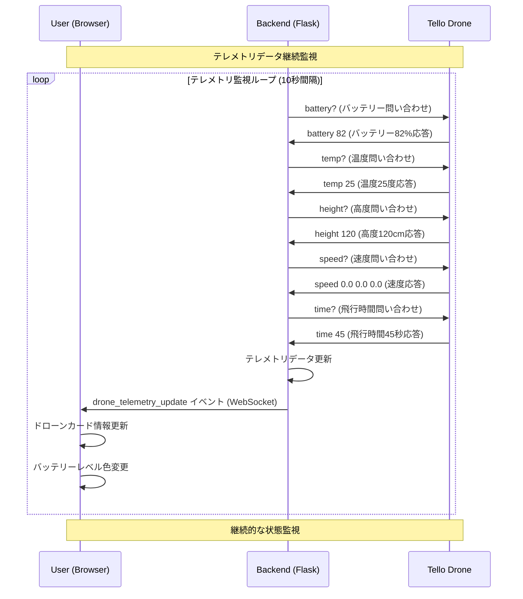
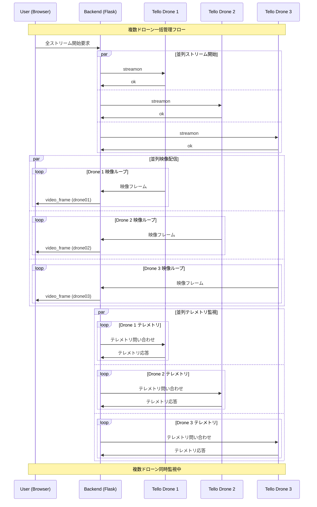
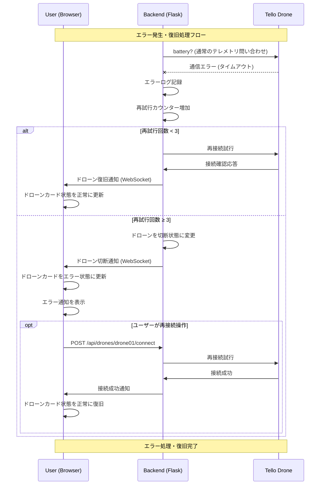
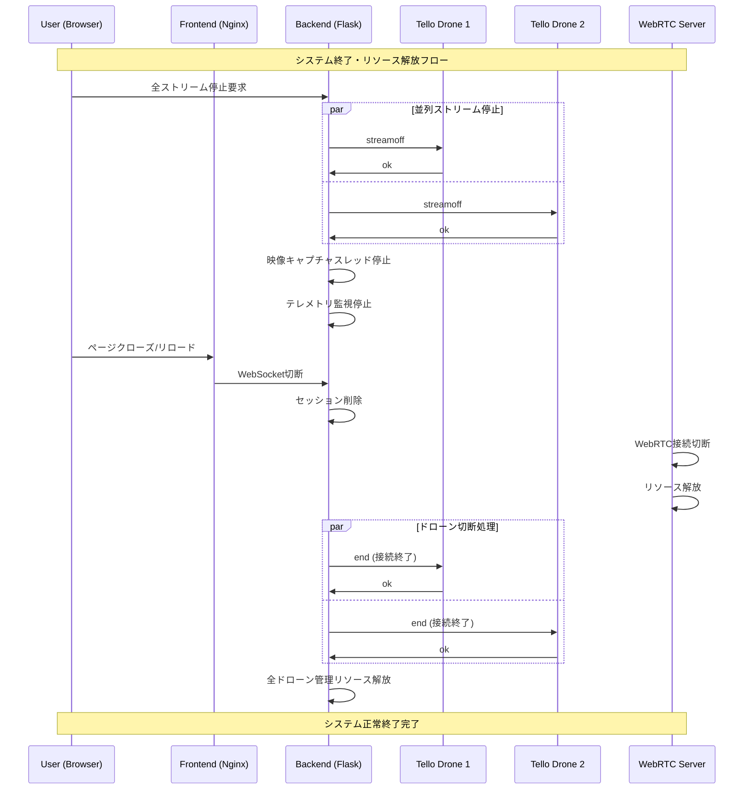

# 🔄 Sequence Diagram (シーケンス図)

DJI Tello Multi-Drone Monitorの主要な処理フローをMermaidシーケンス図で表現します。

## 1. ドローン接続・初期化シーケンス

## 2. 映像ストリーミング開始シーケンス

## 3. WebRTC低レイテンシ配信シーケンス

## 4. テレメトリ監視シーケンス

## 5. 複数ドローン同時管理シーケンス

## 6. エラー処理・復旧シーケンス

## 7. システム終了・クリーンアップシーケンス

## シーケンス図の主要ポイント

### 🔄 非同期・並列処理
- 複数ドローンの同時制御
- 映像配信とテレメトリ監視の並列実行
- WebSocketとWebRTCの同時通信

### ⚡ リアルタイム性
- 30 FPS映像配信
- 10秒間隔テレメトリ更新
- WebRTCによる低レイテンシ通信

### 🛡️ エラー耐性
- 通信エラーの自動検出
- 再試行メカニズム
- ユーザーへの状態通知

### 🔧 リソース管理
- 適切な接続・切断処理
- メモリ・スレッドの適切な解放
- システム終了時のクリーンアップ

これらのシーケンス図は、システムの動作を理解し、デバッグ・トラブルシューティング・機能拡張の指針として活用されます。